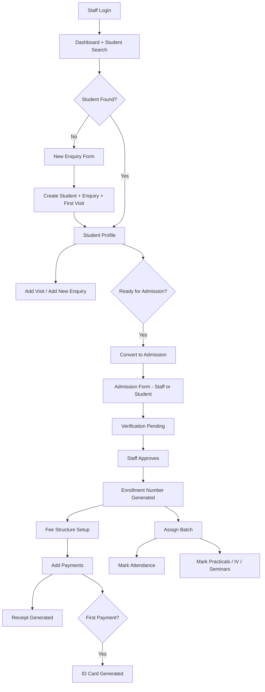
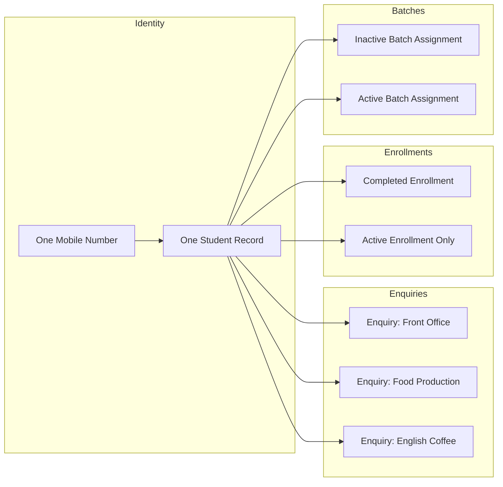
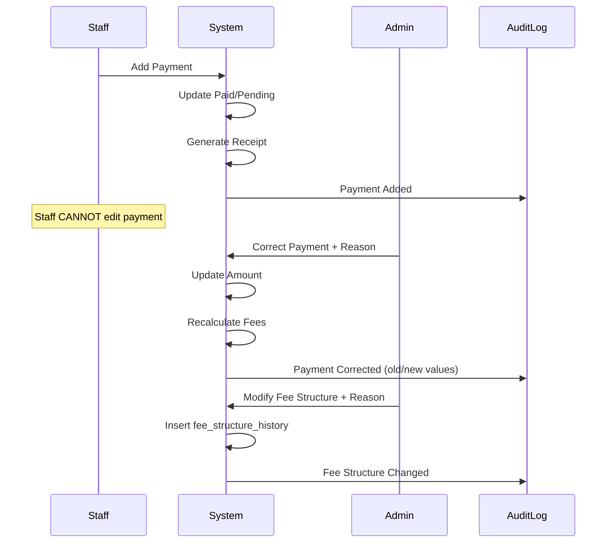
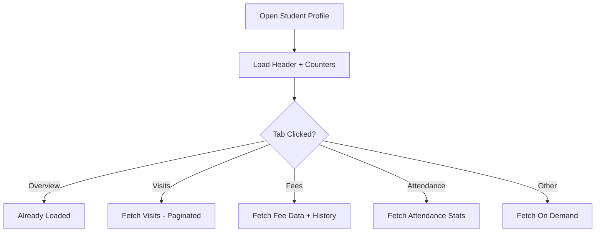

# Folks India ERP & CRM — Master Implementation Plan

**Version:** 1.1 (Final — Approved for Development)  
**Date:** June 2026  
**Status:** Approved — Ready for Phase 0  
**Stack:** Laravel 11 · PHP 8.2+ · MySQL 8 · Filament 3 · Tailwind CSS · DomPDF · Simple QR Code

---

## Table of Contents

1. [Executive Summary](#1-executive-summary)
2. [System Philosophy](#2-system-philosophy)
3. [Application Surfaces](#3-application-surfaces)
4. [User Roles & Permissions](#4-user-roles--permissions)
5. [Student Lifecycle Model](#5-student-lifecycle-model)
6. [Complete Staff Workflow (Step-by-Step)](#6-complete-staff-workflow-step-by-step)
7. [Student Portal Flow](#7-student-portal-flow)
8. [Public Website](#8-public-website)
9. [Student Profile — Central Control Panel](#9-student-profile--central-control-panel)
10. [Status Machines & Business Rules](#10-status-machines--business-rules)
11. [Auto ID & Number Generation](#11-auto-id--number-generation)
12. [Database Design](#12-database-design)
13. [Filament Panel Architecture](#13-filament-panel-architecture)
14. [Document & File Management](#14-document--file-management)
15. [Payment Security & Audit](#15-payment-security--audit)
16. [Reports & Dashboard](#16-reports--dashboard)
17. [Mobile & UX Requirements](#17-mobile--ux-requirements)
18. [Future-Ready Architecture](#18-future-ready-architecture)
19. [Implementation Phases & Sprints](#19-implementation-phases--sprints)
20. [Project Structure](#20-project-structure)
21. [Testing Strategy](#21-testing-strategy)
22. [Deployment Checklist](#22-deployment-checklist)
23. [Decisions Log & Finalized Items](#23-decisions-log--finalized-items)
24. [Performance Requirements](#24-performance-requirements)
25. [Backup & Data Retention Policy](#25-backup--data-retention-policy)
26. [Consolidated Security Requirements](#26-consolidated-security-requirements)

**Appendices:** [A — Daily Flow](#appendix-a-quick-reference--staff-daily-flow) · [B — Packages](#appendix-b-package-dependencies) · [C — System Workflows](#appendix-c-system-workflow-diagrams) · [D — Executive Summary](#appendix-d-executive-summary--full-plan-at-a-glance)

---

## 1. Executive Summary

Folks India requires a web-based ERP and CRM to manage the complete student journey: enquiry → visits → admission → enrollment → fees → batch → attendance → practicals → industrial visits → seminars → reporting.

### Core Design Principle

> **Search Student → Open Student Profile → Manage Everything From One Place**

Staff should not jump between disconnected modules for daily work. The **Student Profile** is the single operational hub. Secondary modules (batch attendance, activity marking) exist for bulk operations but always link back to the student record.

### Three User Experiences

| Surface | Audience | Primary Purpose |
|---------|----------|-----------------|
| Public Website | Prospective students | Course information, institute branding |
| Staff/Admin Panel (Filament) | Super Admin, Staff | Full CRM operations |
| Student Portal | Students | View journey, submit admission form, see fees/receipts/ID card |

### Version 1 Deliverables (20 Modules)

Admin Login · Staff Login · Dashboard · Course Management · Enquiry Management · Visit Tracking · Admission Management · Document Upload · Enrollment Management · Fee Management · Payment Management · Receipt Generation · ID Card Generation · Batch Management · Attendance Management · Practical Management · Industrial Visit Management · Seminar Management · Reports · Audit Logs

**Plus:** Public landing page · Student portal (mobile + DOB login in DDMMYYYY format)

### Approved Architectural Constraints (v1.1)

- One mobile number = one student record (never duplicate)
- Multiple enquiries per student allowed; one active enrollment at a time
- Student Profile uses lazy-loaded tabs + auto-updating counters
- All fee changes and payment corrections are fully auditable with mandatory reason
- Financial report exports restricted to Admin; operational reports available to Staff
- Documents stored in `storage/app/private` only — never publicly accessible
- Daily DB backup + weekly file backup (mandatory)
- Architecture must be OTP-ready for V2 without database redesign

---

## 2. System Philosophy

### 2.1 Student-Centric, Not Module-Centric

Traditional ERPs force staff to think in modules (Enquiries, Admissions, Fees). Folks India CRM inverts this:

```
WRONG:  Enquiry Module → Admission Module → Fee Module → Attendance Module
RIGHT:  Search → Student Profile → [Tab: Visits | Admission | Fees | Attendance | ...]
```

Bulk modules (mark batch attendance, mark seminar attendance) are shortcuts that write to the same underlying student records.

### 2.2 Permanent History

- No enquiry is ever permanently deleted (soft delete at most, Admin-only).
- Every visit is append-only.
- Payments are immutable for Staff after save.
- Audit log captures all corrections.

### 2.3 Mobile-First Operations

Front-desk staff use phones and tablets. Every critical flow — search, enquiry, add visit, add payment, mark attendance — must work on a 375px screen without horizontal scrolling.

### 2.4 Single Source of Truth

One `students` record per person (keyed by mobile number). Enquiries, admissions, enrollments, and fees are **lifecycle stages**, not duplicate identities.

### 2.5 Multiple Enquiry & Enrollment Policy (Approved)

```
One Mobile Number = One Student Record (never duplicate)

Student (7017057275)
   │
   ├── Enquiry: Front Office      (FI-ENQ-2026-000001)
   ├── Enquiry: Food Production   (FI-ENQ-2026-000045)
   └── Enquiry: English Coffee    (FI-ENQ-2026-000089)

Student (7017057275)
   │
   ├── Enrollment: Completed      (FI-2025-000012) ← historical
   └── Enrollment: Active         (FI-2026-000001) ← only one active
```

**Rules:**
- Returning student with existing mobile → open Student Profile (never create duplicate student)
- New course interest → add new enquiry on existing student record
- Only **one active enrollment** at a time; previous enrollments remain as history
- Only **one active batch** at a time; reassignment auto-deactivates previous

---

## 3. Application Surfaces

### 3.1 Staff/Admin Panel — `/admin`

Filament panel. Default landing after login: **Dashboard with prominent Student Search**.

### 3.2 Student Portal — `/student`

Lightweight Blade-based portal (not full Filament — simpler, faster, mobile-friendly).

#### V1 Authentication (Approved)

| Field | Format | Example |
|-------|--------|---------|
| Username | 10-digit mobile number | `7017057275` |
| Password | DOB as DDMMYYYY (8 digits) | `15082005` (15 Aug 2005) |

**Security:**
- Password is **never** stored in plain text
- On save/login: `Hash::make($dobFormatted)` via Laravel Hash
- Login compares: `Hash::check($input, $student->portal_password)`

#### V2 OTP Readiness (No DB Redesign)

Architecture must support future OTP flow without schema changes:

```
Enter Mobile → Send OTP → Verify OTP → Login Success
```

**V1 preparation (no OTP UI yet):**
- `student_auth_method` column on `students` (default: `dob`, future: `otp`)
- Optional `otp_verifications` table (mobile, otp_hash, expires_at) — migrate in V1, use in V2
- Auth service abstraction: `StudentAuthService` with `loginWithDob()` and stub `loginWithOtp()`

**Portal capabilities:**
- Read-only for most data
- Submit admission form when status allows
- View: visits, fee summary, payments, receipts, ID card, attendance/activity counters

### 3.3 Public Website — `/`

Marketing landing page with course cards (name, duration, fee, description). Mobile-perfect responsive layout. No login required.

---

## 4. User Roles & Permissions

### 4.1 Super Admin

| Area | Permissions |
|------|-------------|
| Staff | Create, edit, deactivate |
| Courses | Full CRUD |
| Batches | Full CRUD |
| Fee structures | Edit, correct |
| Payments | Edit amount, date, mode (with audit) |
| Records | Delete (soft) enquiries, students, admissions |
| Reports | All (including financial, audit, discount, payment) |
| Audit logs | View + export |
| Settings | Institute name, logo, receipt header, ID card design |
| Fee structure | Modify course fee, discount, net fee (mandatory reason) |
| Records | Soft delete only — enquiries, students, admissions (recoverable) |

### 4.2 Staff

| Area | Permissions |
|------|-------------|
| Student search | Yes |
| Enquiry | Create, edit (add new enquiry on existing student) |
| Visits | Add, edit |
| Admission | Convert, fill form, submit, **approve** |
| Documents | Upload |
| Fees | Set initial discount on enrollment (Admin modifies later) |
| Payments | Add only — cannot edit, delete, or change amount/date/mode |
| Receipts | Generate, download |
| ID cards | Download |
| Batches | Create, assign students (auto-deactivates previous batch) |
| Attendance | Mark (batch + student) |
| Activities | Create sessions, mark attendance |
| Reports — export | Enquiry, Admission, Attendance, Practical, Seminar, Industrial Visit |
| Reports — NO export | Fee, Discount, Payment, Audit, Financial (Admin only) |
| Students | Update details — **cannot delete** student, enquiry, admission, or enrollment |

### 4.3 Student

| Area | Permissions |
|------|-------------|
| Profile | View own data |
| Visits | View timeline |
| Admission form | Fill & submit when unlocked |
| Fees | View summary (read-only) |
| Payments | View history (read-only) |
| Receipts | Download own |
| ID card | Download when generated |
| Attendance/Activities | View counts and history |

### 4.4 Permission Implementation

Use **Spatie Laravel Permission** + **Filament Shield** (or native Filament policies).

Critical policies:
- `PaymentPolicy::update` → Admin only (mandatory reason field)
- `PaymentPolicy::delete` → Admin only (soft delete if ever needed)
- `EnquiryPolicy::delete` → Admin only (soft delete)
- `StudentPolicy::delete` → Admin only (soft delete)
- `AdmissionPolicy::delete` → Admin only (soft delete)
- `EnrollmentPolicy::delete` → Admin only (soft delete)
- `FeeStructurePolicy::update` → Admin only for post-setup changes (with reason → history table)
- `ReportPolicy::exportFinancial` → Admin only

### 4.5 Report Export Permission Matrix (Approved)

| Report Category | Staff Export | Admin Export |
|---------------|:------------:|:------------:|
| Enquiry (daily/weekly/monthly/source) | ✅ | ✅ |
| Admission (course/staff-wise) | ✅ | ✅ |
| Attendance (batch/student) | ✅ | ✅ |
| Practical / Seminar / Industrial Visit | ✅ | ✅ |
| Fee Collection | ❌ | ✅ |
| Pending Fees | ❌ | ✅ |
| Discount Report | ❌ | ✅ |
| Payment Mode Report | ❌ | ✅ |
| Audit Logs | ❌ | ✅ |
| Financial Reports | ❌ | ✅ |

---

## 5. Student Lifecycle Model

```
┌─────────────┐
│   VISITOR   │  (not in system)
└──────┬──────┘
       │ Staff search → not found → New Enquiry
       ▼
┌─────────────┐
│   ENQUIRY   │  FI-ENQ-2026-000001 · First visit auto-created
└──────┬──────┘
       │ Follow-up visits (Add Visit on profile)
       ▼
┌─────────────┐
│  PROSPECT   │  Status: Interested / Follow-up / Admission Ready
└──────┬──────┘
       │ Convert to Admission
       ▼
┌─────────────┐
│  ADMISSION  │  FI-ADM-2026-000001 · Form + documents
│  SUBMITTED  │
└──────┬──────┘
       │ Staff or Student submits form
       ▼
┌─────────────┐
│ VERIFICATION│  Document check
│   PENDING   │
└──────┬──────┘
       │ Staff approves
       ▼
┌─────────────┐
│  APPROVED   │
└──────┬──────┘
       │ Auto-generate enrollment number
       ▼
┌─────────────┐
│  ENROLLED   │  FI-2026-000001 · Fee structure setup
└──────┬──────┘
       │ First payment
       ▼
┌─────────────┐
│   ACTIVE    │  ID card generated · Batch assigned
│   STUDENT   │
└──────┬──────┘
       │ Training period
       ▼
┌─────────────┐
│  COMPLETED  │  (Future: certificate generation)
└─────────────┘
```

### Parallel Tracks After Enrollment

Once enrolled, these run concurrently and all reflect on Student Profile:

- Fee collection (ongoing until pending = 0)
- Batch assignment
- Class attendance
- Practical sessions
- Industrial visits
- Seminars

---

## 6. Complete Staff Workflow (Step-by-Step)

This section maps every step from the Staff Workflow document to system behavior, screens, and data changes.

---

### STEP 1: Staff Login

**Screen:** `/admin/login`

**After login → Dashboard**

| Widget | Query Logic |
|--------|-------------|
| Total Enquiries | `COUNT(enquiries)` where not soft-deleted |
| Today's Enquiries | `enquiries.created_at = today` |
| Admissions This Month | `admissions` created this month |
| Active Students | `enrollments.status = enrolled` AND not completed |
| Pending Admissions | `admissions.status IN (submitted, verification_pending)` |
| Fee Collection Today | `SUM(payments.amount)` where `payment_date = today` |
| Pending Fees | `SUM(fee_structures.pending_amount)` |
| Active Batches | `batches` where `end_date >= today` AND status active |

**Charts (Phase 2 dashboard polish):**
- Monthly Admissions (bar/line)
- Monthly Fee Collection
- Lead Source Analysis (pie)
- Course-wise Admissions (bar)

**Prominent element:** Student Search box (large, top of dashboard, also in top nav on every page).

---

### STEP 2: Student Search

**Screen:** Custom Filament page — `StudentSearch` (also embedded in Dashboard)

**Search inputs:**
- Mobile Number (primary — 10 digits, Indian format)
- Student Name (partial match)
- Enrollment Number (exact match)

**Search priority:**
1. If mobile entered → exact match on `students.mobile`
2. If enrollment → exact match on `enrollments.enrollment_number`
3. If name → `LIKE` on `students.name` (show list if multiple matches)

**Scenario A — Found:**
→ Redirect/open **Student Profile** (`/admin/students/{id}`)

**Scenario B — Not Found:**
→ Auto-open **New Enquiry Form** with mobile pre-filled (no extra button click)

**Scenario C — Student Found, New Course Interest:**
→ Open Student Profile → staff clicks **"Add New Enquiry"** for different course (reuses same student record)

**Performance:** Search must return within **2 seconds**. Indexes on `students.mobile`, `enrollments.enrollment_number`, `enquiries.enquiry_number`.

---

### STEP 3: New Enquiry Creation

**Trigger:** Search not found OR manual "New Enquiry" (secondary action)

**Form sections:**

#### Personal Details
| Field | Type | Validation |
|-------|------|------------|
| Student Name | Text | Required |
| Father's Name | Text | Required |
| Date of Birth | Date | Required |
| Gender | Select | Male/Female/Other |
| Mobile Number | Text | Required, 10 digits, unique |
| Alternate Mobile | Text | Optional, 10 digits |
| Email | Email | Optional |

#### Address Details
| Field | Type |
|-------|------|
| Address | Textarea |
| City | Text |
| State | Text/Select |
| Pincode | Text, 6 digits |

#### Category
Dropdown: General · OBC · SC · ST · EWS

#### Course Interest
Select from active courses → **on change**, display:
- Duration (e.g., "6 Months")
- Course Fee (e.g., "₹50,000")

#### Lead Source
Website · Facebook · Instagram · Google · Walk-in · Student Reference · Seminar · Banner · Newspaper · Other

#### Meeting Information
- **Meeting With:** Auto-default to logged-in staff name (editable dropdown of active staff)
- **Meeting For:** Folks India · English Coffee

#### Visit Type
- **First Visit** (default for new enquiry)
- **Follow-up Visit** → shows mandatory **Reason For Visit** field

---

### STEP 4: Enquiry Save Process

**On save, system automatically:**

1. **If new mobile:** Create `students` record + hash DOB as `portal_password`
2. **If existing mobile:** Reuse student record — **never create duplicate**
3. Create `enquiries` record with auto-generated `FI-ENQ-YYYY-XXXXXX`
4. Create first `visits` record linked to enquiry
5. Set/update student lifecycle status → `enquiry` (if no active enrollment)
6. Write audit log: "Enquiry Created" (with user name, role, IP)
7. Redirect to **Student Profile**

**Rules:**
- Enquiries are never hard-deleted (Admin soft delete only — BR-26)
- Mobile number uniqueness enforced at student level (BR-13)
- Multiple enquiries per student allowed across different courses (BR-14)

---

### STEP 5: Follow-Up Management

**Trigger:** Staff searches existing mobile → Student Profile opens

**Action:** Click **"Add Visit"** (button always visible on profile header)

| Field | Type |
|-------|------|
| Visit Date | Date, default today |
| Staff Name | Auto-fill logged-in staff |
| Discussion Summary | Textarea |
| Remarks | Textarea |
| Next Follow-up Date | Date, optional |
| Status | Interested · Follow-up Required · Admission Ready · Not Interested · Joined |

**On save:**
- Append visit to timeline (never overwrite previous)
- Update enquiry `latest_status` for reporting
- Audit log: "Visit Added"

**Timeline display example:**
```
01 Apr 2026 — First Visit — Interested — Staff: Rahul
05 Apr 2026 — Follow-up — Follow-up Required — Staff: Rahul
10 Apr 2026 — Follow-up — Admission Ready — Staff: Priya
```

---

### STEP 6: Student Profile (Main Working Screen)

**URL:** `/admin/students/{id}`  
**This is the most important screen in the entire system.**

#### Profile Header (always visible — loaded on page open)

- Student name, mobile, enrollment number (if exists)
- Current status badge (Enquiry / Admission Pending / Enrolled / etc.)
- Active course name + batch name (if assigned)
- **Auto-updating counter strip** (recalculated on related record create/update):

| Counter | Source |
|---------|--------|
| Total Visits | `COUNT(visits)` |
| Attendance % | Calculated from active batch attendances |
| Industrial Visits | `COUNT(activity_attendances)` for IV |
| Seminars Attended | `COUNT(activity_attendances)` for seminars |
| Practicals Attended | `COUNT(activity_attendances)` for practicals |
| Total Fees | `fee_structures.net_fee` (active enrollment) |
| Paid Amount | `fee_structures.paid_amount` |
| Pending Amount | `fee_structures.pending_amount` |

- Quick action buttons:
  - Add Visit
  - Add New Enquiry (if returning for different course)
  - Convert to Admission (if status allows)
  - Add Payment (if enrolled)
  - Assign Batch (if enrolled)
  - Download ID Card (if generated)

#### Tabs (Lazy-Loaded — BR-21)

Only **Overview** loads on page open. Other tabs fetch data via Livewire `wire:init` or tab-click event.

| Tab | Load Trigger | Content |
|-----|--------------|---------|
| **Overview** | Immediate | Personal info, address, category, all enquiries list, lead source |
| **Visits** | On click | Chronological timeline (paginated if 100+), Add Visit |
| **Admission** | On click | Admission status, form data, Convert/Approve actions |
| **Documents** | On click | Upload grid, preview via signed URL, download |
| **Fees** | On click | Fee breakdown, discount, paid, pending, change history (Admin), Add Payment |
| **Receipts** | On click | List with download/print (paginated if 100+) |
| **Attendance** | On click | Stats + records (paginated) |
| **Practicals** | On click | Participation list + count |
| **Industrial Visits** | On click | Visit list + count |
| **Seminars** | On click | Seminar list + count |
| **Activity Log** | On click | Audit entries for this student (paginated) |

**Performance target:** Profile remains usable with 100+ visits, 100+ payments, 2+ years of attendance data.

---

### STEP 7: Convert to Admission

**Trigger:** Staff clicks **"Convert to Admission"** on Student Profile

**Preconditions:**
- Student has at least one enquiry for the target course
- No active enrollment already exists for this course (BR-15)
- Status is NOT already in admission pipeline for same enquiry
- Latest visit status is ideally "Admission Ready" (warning if not, but allow override)

**On click:**
1. Create `admissions` record with `FI-ADM-YYYY-XXXXXX`
2. Pre-fill all enquiry/student data (no re-entry)
3. Set status → `admission_submitted` (form opens for additional fields)
4. Unlock admission form on **Student Portal** simultaneously
5. Audit log: "Converted to Admission"

---

### STEP 8: Admission Form

**Accessible from:** Student Profile → Admission tab AND Student Portal

**Either staff OR student can fill and submit.**

#### Academic Details
| Field | Type |
|-------|------|
| 10th Board | Text |
| 10th Percentage | Decimal |
| 12th Board | Text |
| 12th Percentage | Decimal |
| Graduation | Text |
| Graduation Percentage | Decimal |

#### Required Uploads (Mandatory)
| Document | Validation |
|----------|------------|
| Student Photo | Image, max 2MB |
| Aadhaar Card | Image/PDF |
| Marksheet | Image/PDF |
| Signature | Image |

#### Optional Uploads
- Transfer Certificate
- Character Certificate
- Other Documents (multiple allowed)

**On submit (by staff or student):**
- Status → `verification_pending`
- Staff notified (future: WhatsApp/email)
- Audit log: "Admission Form Submitted"

---

### STEP 9: Admission Approval

**Status flow:**

```
enquiry → admission_submitted → verification_pending → approved → enrolled
```

**Staff actions on Admission tab:**

| Action | Who | Result |
|--------|-----|--------|
| Submit Form | Staff/Student | → verification_pending |
| Approve | Staff ✅ (O-01 finalized) | → approved, generate enrollment number |
| Reject/Return | Staff | → admission_submitted with remarks |

**On approval:**
1. Validate: student has no other `enrollments.status = enrolled` (BR-15)
2. Create `enrollments` record with `is_active = true`
3. Auto-generate `FI-YYYY-XXXXXX` (enrollment number)
4. Status → `enrolled`
5. Auto-open Fee Structure Setup (Step 10)
6. Audit log: "Admission Approved, Enrollment Generated"

---

### STEP 10: Fee Structure Setup

**Trigger:** Automatically after enrollment approval (modal or redirect to Fees tab)

| Field | Source |
|-------|--------|
| Course Fee | Auto from course |
| Duration | Auto from course |
| Discount Amount | Staff input (default 0) |
| Net Fee | Calculated: course_fee - discount |
| Paid Amount | 0 initially |
| Pending Amount | = Net Fee initially |

**Staff confirms → saves initial fee structure.**

Student sees fee summary on portal (read-only).

#### Fee Structure Change History (Admin Only — BR-17, BR-25)

After initial setup, only **Admin** may modify course fee, discount, or net fee.

**Mandatory:** Reason field before any modification.

| Reason Examples |
|----------------|
| Scholarship Approved |
| Management Discount |
| Data Entry Correction |

**On Admin modification:**
1. Insert row into `fee_structure_history` (old + new values)
2. Update `fee_structures` record
3. Recalculate `pending_amount` if needed
4. Audit log with user name, role, IP, old/new values, reason

---

### STEP 11: Fee Collection Process

**Location:** Student Profile → Fees tab → **Add Payment**

| Field | Type | Required |
|-------|------|----------|
| Payment Date | Date | Yes |
| Amount | Decimal | Yes, ≤ pending |
| Payment Mode | Select | Cash / Online / UPI |

#### Mode-Specific Fields

| Mode | Additional Required Fields |
|------|---------------------------|
| Cash | Voucher Number, Voucher Image |
| Online | Transaction ID, Payment Screenshot |
| UPI | UTR Number, Screenshot |

**On save:**
1. Create `payments` record
2. Update `fee_structures.paid_amount` and `pending_amount`
3. Generate receipt (Step 12)
4. If first payment → generate ID card (Step 13)
5. Audit log: "Payment Added — ₹X"

**Payment security:** Staff cannot edit or delete after save.

---

### STEP 12: Receipt Generation

**Trigger:** Immediately after payment save

**Receipt Number:** `REC-YYYY-XXXXXX`

**PDF contents (DomPDF):**
- Institute logo and name
- Receipt number
- Student name
- Enrollment number
- Course name
- Payment amount (numeric + words)
- Payment date
- Payment mode
- Staff name
- Footer with terms

**Actions:** Download PDF · Print

Stored at: `storage/app/private/receipts/{enrollment_number}/`

---

### STEP 13: ID Card Generation

**Trigger:** First payment received (any amount > 0)

**PDF contents:**
- Student photo (from admission documents)
- Student name
- Enrollment number
- Course name
- Duration
- QR Code (encodes: enrollment number + verification URL)

**Actions:** Download from Student Profile, Admin panel, Student Portal

**Regeneration:** Admin can regenerate if photo changes.

---

### STEP 14: Batch Management

**Module:** `/admin/batches` (list) + create/edit

| Field | Type |
|-------|------|
| Batch Name | Text (e.g., "Front Office Batch A") |
| Course | Select (linked course) |
| Trainer | Select (staff user) |
| Start Date | Date |
| End Date | Date |
| Status | Active / Completed |

---

### STEP 15: Student Batch Assignment

**From Student Profile:** "Assign Batch" action  
**From Batch screen:** Bulk assign students

**Rules (BR-16):**
- One student = one active batch at a time
- Assigning to new batch **automatically deactivates** previous assignment (`is_active = false`)
- Creates new `batch_student` row with `is_active = true`
- Audit log entry records: student, old batch, new batch, staff name, date

**Example audit entry:**
```
Action: Batch Reassigned
Student: Amit Kumar
From: Front Office Batch A
To: Front Office Batch B
By: Rahul
Date: 05-Jun-2026
```

Batch name immediately visible on profile header.

---

### STEP 16: Attendance Management

**Bulk flow (primary for daily use):**

```
Batches → Select Batch → Attendance → Pick Date → Mark All → Save
```

| Status | Code |
|--------|------|
| Present | P |
| Absent | A |
| Leave | L |

**Per-student view:** Student Profile → Attendance tab

**Auto-calculated:**
```
Attendance % = (Present / Total Classes) × 100
```

Total classes = count of attendance records for student's active batch.

---

### STEP 17: Practical Management

**Categories (fixed enum):**
- Front Office
- Food Production
- Housekeeping
- F&B Service

**Flow:**
```
Practicals → Select Category → Select Batch → Select Date → Mark Students Present → Save
```

Updates `practical_participations` and count on Student Profile.

---

### STEP 18: Industrial Visit Management

**Create visit:**

| Field | Type |
|-------|------|
| Visit Name | Text (e.g., "Hotel Taj Visit") |
| Location | Text |
| Date | Date |
| Description | Textarea |

**Flow:**
```
Industrial Visits → Create → Select Batch → Mark Attendance → Save
```

Student Profile → Industrial Visits tab shows list + total count.

---

### STEP 19: Seminar Management

**Types (fixed enum):**
- Interview Seminar
- Motivational Seminar
- Personality Development
- Career Guidance

**Flow:** Same as industrial visits — create session, select batch, mark attendance.

---

### STEP 20: Reporting

| Report | Filters | Staff Export | Admin Export |
|--------|---------|:------------:|:------------:|
| Enquiry Daily/Weekly/Monthly | Date range | ✅ | ✅ |
| Enquiry Source-wise | Date range, source | ✅ | ✅ |
| Admission Course-wise | Date range, course | ✅ | ✅ |
| Admission Staff-wise | Date range, staff | ✅ | ✅ |
| Attendance Batch-wise | Batch, date range | ✅ | ✅ |
| Attendance Student-wise | Student, date range | ✅ | ✅ |
| Practical / Seminar / IV Activity | Date range, type | ✅ | ✅ |
| Fee Collection | Date range | ❌ | ✅ |
| Pending Fees | Course, batch | ❌ | ✅ |
| Discount Report | Date range | ❌ | ✅ |
| Payment Mode Report | Date range | ❌ | ✅ |
| Audit Log Report | Date range, user | ❌ | ✅ |
| Financial Summary | Date range | ❌ | ✅ |

**Export formats:** Excel · PDF · Print

**Implementation:** Filament custom pages with filters + `maatwebsite/excel` + DomPDF. Export buttons gated by `ReportPolicy`.

---

### STEP 21: Security & Audit Logs

**Logged actions (minimum):**

| Action | Model |
|--------|-------|
| Enquiry Created | Enquiry |
| Student Updated | Student |
| Visit Added | Visit |
| Converted to Admission | Admission |
| Admission Approved | Admission |
| Enrollment Generated | Enrollment |
| Fee Structure Set | FeeStructure |
| Payment Added | Payment |
| Payment Corrected (Admin) | Payment |
| Batch Assigned | BatchStudent |
| Attendance Marked | Attendance |
| Document Uploaded | Document |
| Activity Attendance Marked | ActivityAttendance |

**Log fields (Enhanced — BR-20):**

| Field | Example |
|-------|---------|
| `user_id` | Admin user ID |
| `user_name` | "Rahul Sharma" (denormalized for report speed) |
| `user_role` | "Super Admin" / "Staff" |
| `action` | "Payment Corrected" |
| `auditable_type` + `auditable_id` | Polymorphic reference |
| `old_values` (JSON) | `{"amount": 5000}` |
| `new_values` (JSON) | `{"amount": 7000}` |
| `reason` | "Voucher Entry Error" (required for corrections) |
| `ip_address` | `192.168.1.10` |
| `created_at` | Date + time |

**Example log entry:**
```
Action: Payment Corrected
User: Admin (Super Admin)
Date: 05-Jun-2026 14:32
Old Amount: ₹5,000 → New Amount: ₹7,000
Reason: Voucher Entry Error
IP: 192.168.1.10
```

**Implementation:** Laravel Observer pattern on all critical models. Custom `AuditService` centralizes logging.

---

## 7. Student Portal Flow

### 7.1 Login (Approved Policy)

- URL: `/student/login`
- **Username:** 10-digit mobile number (e.g., `7017057275`)
- **Password:** DOB entered as DDMMYYYY (e.g., `15082005` for 15-Aug-2005)
- On student create/update: system formats DOB → DDMMYYYY → `Hash::make()` → stored in `portal_password`
- Login: `Hash::check($inputPassword, $student->portal_password)`
- Session-based auth with separate `student` guard
- **Never** store or log plain-text DOB password

### 7.1.1 Future OTP Login (V2 — Architecture Ready)

```
Mobile Number → Send OTP → Verify OTP → Session Created
```

No database redesign required. `StudentAuthService` interface prepared in V1.

### 7.2 Portal Screens

| Screen | When Visible | Actions |
|--------|--------------|---------|
| Dashboard | Always | View status summary |
| My Visits | After enquiry | Read-only timeline |
| Admission Form | After convert to admission | Fill & submit (if not yet submitted) |
| My Fees | After enrollment | View totals (read-only) |
| My Payments | After first payment | View history |
| Receipts | After first payment | Download PDFs |
| ID Card | After first payment | Download PDF |
| Attendance | After batch assigned | View stats |
| Activities | After activities marked | View counts |

### 7.3 Student Cannot

- Edit personal details (must visit institute)
- Add payments
- Mark attendance
- Delete anything

---

## 8. Public Website

### 8.1 Pages (V1)

| Page | Content |
|------|---------|
| Home `/` | Hero, institute intro, course highlights, CTA |
| Courses | All active courses with duration, fee, description |
| Contact | Address, phone, map (optional) |

### 8.2 Design

- Tailwind CSS, mobile-first
- No Filament — pure Blade components
- Fast loading, no heavy JS

### 8.3 Future

- Online enquiry form (creates enquiry via API)
- WhatsApp chat button

---

## 9. Student Profile — Central Control Panel

### 9.1 Why This Matters

80% of staff time is spent on existing students, not browsing lists. The profile must be:

- **Fast to load** — Overview + counters on initial load only; all other tabs lazy-loaded (BR-21)
- **Counter-driven** — header stats auto-update when visits, payments, attendance, or activities are recorded
- **Action-oriented** — primary buttons in header, not buried in menus
- **Status-aware** — show/hide actions based on lifecycle stage
- **Scalable** — pagination inside tabs for 100+ records; profile usable with 2+ years of data

### 9.2 Action Visibility Matrix

| Action | Enquiry | Admission Pending | Enrolled | Completed |
|--------|---------|-------------------|----------|-----------|
| Add Visit | ✅ | ✅ | ✅ | ❌ |
| Convert to Admission | ✅ | ❌ | ❌ | ❌ |
| Fill Admission Form | ❌ | ✅ | ❌ | ❌ |
| Approve Admission | ❌ | ✅ (Staff) | ❌ | ❌ |
| Setup/View Fees | ❌ | ❌ | ✅ | ✅ |
| Add Payment | ❌ | ❌ | ✅ | ✅ |
| Assign Batch | ❌ | ❌ | ✅ | ❌ |
| Download ID Card | ❌ | ❌ | ✅ (if generated) | ✅ |

### 9.3 Filament Implementation

Custom `ViewStudent` page extending Filament's `Page` with:
- `InteractsWithForms` for inline actions
- Livewire tabs with **lazy loading** per tab (`wire:click` triggers data fetch)
- `StudentCounterService` for header stats (cached 60s, invalidated on write)
- Paginated relation lists inside tabs (25 per page default)
- Relation managers embedded per tab

### 9.4 Student Profile Counters (Auto-Updating)

Counters in profile header recalculate when:

| Event | Counters Updated |
|-------|------------------|
| Visit created | Total Visits |
| Payment added | Paid, Pending |
| Fee structure changed | Total Fees, Pending |
| Attendance saved | Attendance % |
| Activity attendance saved | IV / Seminar / Practical counts |

Implementation: `StudentCounterService::refresh($studentId)` called from observers after relevant saves.

---

## 10. Status Machines & Business Rules

### 10.1 Student Status (master)

```
enum StudentStatus: string {
    case ENQUIRY = 'enquiry';
    case ADMISSION_SUBMITTED = 'admission_submitted';
    case VERIFICATION_PENDING = 'verification_pending';
    case APPROVED = 'approved';
    case ENROLLED = 'enrolled';
    case COMPLETED = 'completed';
    case DROPPED = 'dropped';
}
```

### 10.2 Visit Status

```
enum VisitStatus: string {
    case INTERESTED = 'interested';
    case FOLLOW_UP_REQUIRED = 'follow_up_required';
    case ADMISSION_READY = 'admission_ready';
    case NOT_INTERESTED = 'not_interested';
    case JOINED = 'joined';
}
```

### 10.3 Key Business Rules

| # | Rule |
|---|------|
| BR-01 | Mobile number is unique per student |
| BR-02 | One active batch per student at a time |
| BR-03 | Enrollment number generated only on approval |
| BR-04 | ID card generated only on first payment |
| BR-05 | Staff cannot modify saved payments |
| BR-06 | Enquiries are never hard-deleted |
| BR-07 | Fee pending cannot go below zero |
| BR-08 | Payment amount cannot exceed pending fee |
| BR-09 | Admission form unlocks on both staff panel and student portal simultaneously |
| BR-10 | Follow-up visit requires reason field |
| BR-11 | Receipt auto-generated on every payment |
| BR-12 | All file uploads timestamped with uploader ID |
| BR-13 | One mobile number = one student record (never duplicate) |
| BR-14 | One student = multiple enquiries allowed (different courses) |
| BR-15 | One student = one active enrollment at a time |
| BR-16 | One student = one active batch at a time (reassignment auto-deactivates previous) |
| BR-17 | Fee structure changes require mandatory reason (Admin only) |
| BR-18 | Payments are immutable for Staff (amount, date, mode) |
| BR-19 | Student documents must be private (`storage/app/private` only) |
| BR-20 | All critical changes must be audited (user, role, IP, old/new values) |
| BR-21 | Student Profile must use lazy-loaded tabs |
| BR-22 | Daily database backup is mandatory (30-day retention) |
| BR-23 | Weekly file backup is mandatory (90-day retention) |
| BR-24 | System must be OTP-ready for future authentication |
| BR-25 | All financial changes must be traceable via `fee_structure_history` |
| BR-26 | Soft delete only for critical records (Admin only, recoverable) |
| BR-27 | Student Profile is the primary operational screen |
| BR-28 | All modules must be mobile responsive |

---

## 11. Auto ID & Number Generation

### 11.1 Formats

| Type | Format | Example |
|------|--------|---------|
| Enquiry | `FI-ENQ-{YYYY}-{6-digit}` | FI-ENQ-2026-000001 |
| Admission | `FI-ADM-{YYYY}-{6-digit}` | FI-ADM-2026-000001 |
| Enrollment | `FI-{YYYY}-{6-digit}` | FI-2026-000001 |
| Receipt | `REC-{YYYY}-{6-digit}` | REC-2026-000001 |

### 11.2 Implementation

```php
// App\Services\NumberGeneratorService

class NumberGeneratorService
{
    public function generate(string $type, int $year): string
    {
        // Use DB transaction with row lock on sequences table
        // Increment counter atomically
        // Return formatted string
    }
}
```

**`number_sequences` table:**

| Column | Type |
|--------|------|
| id | bigint |
| type | string (enquiry, admission, enrollment, receipt) |
| year | int |
| last_number | int |
| UNIQUE(type, year) | |

This prevents duplicate IDs under concurrent requests.

---

## 12. Database Design

### 12.1 Entity Relationship Overview

```
users ──────────────┬── staff_profiles
                    │
students ───────────┼── enquiries ── visits
     │              │
     ├── admissions ── documents
     │              │
     ├── enrollments ── fee_structures ── fee_structure_history ── payments ── receipts
     │              │
     └── batch_students ── batches ── courses
                              │
                    attendances (batch + date + student)
                              │
              ┌───────────────┼───────────────┐
              │               │               │
      practical_sessions  industrial_visits  seminars
              │               │               │
              └──── activity_attendances ─────┘
                              │
                        audit_logs
```

### 12.2 Table Definitions

#### `users`
| Column | Type | Notes |
|--------|------|-------|
| id | bigint PK | |
| name | string | |
| email | string unique | Staff/Admin login |
| password | string | |
| mobile | string nullable | |
| is_active | boolean | |
| timestamps | | |

#### `students`
| Column | Type | Notes |
|--------|------|-------|
| id | bigint PK | |
| name | string | |
| father_name | string | |
| date_of_birth | date | Also used for portal login |
| gender | enum | |
| mobile | string unique | **Primary search key** |
| alternate_mobile | string nullable | |
| email | string nullable | |
| address | text | |
| city | string | |
| state | string | |
| pincode | string | |
| category | enum | general, obc, sc, st, ews |
| status | enum | StudentStatus |
| portal_password | string nullable | Hashed DOB (DDMMYYYY format) |
| auth_method | enum default `dob` | dob, otp (V2) |
| timestamps | | |
| soft_deletes | | Admin only (BR-26) |

**Indexes:** `UNIQUE(mobile)` · `INDEX(name)` for search

#### `courses`
| Column | Type | Notes |
|--------|------|-------|
| id | bigint PK | |
| name | string | |
| code | string unique | |
| duration | int | |
| duration_type | enum | months, years |
| fee | decimal(10,2) | |
| description | text nullable | |
| status | enum | active, inactive |
| timestamps | | |

#### `enquiries`
| Column | Type | Notes |
|--------|------|-------|
| id | bigint PK | |
| student_id | FK students | |
| enquiry_number | string unique | FI-ENQ-... |
| course_id | FK courses | |
| lead_source | enum | |
| meeting_with_user_id | FK users | |
| meeting_for | enum | folks_india, english_coffee |
| visit_type | enum | first_visit, follow_up |
| follow_up_reason | text nullable | |
| latest_visit_status | enum nullable | Denormalized for reports |
| timestamps | | |
| soft_deletes | | |

**Indexes:** `UNIQUE(enquiry_number)` · `INDEX(student_id)` · `INDEX(course_id)`

#### `visits`
| Column | Type | Notes |
|--------|------|-------|
| id | bigint PK | |
| student_id | FK students | |
| enquiry_id | FK enquiries nullable | |
| visit_date | date | |
| staff_user_id | FK users | |
| discussion_summary | text | |
| remarks | text nullable | |
| next_follow_up_date | date nullable | |
| status | enum VisitStatus | |
| timestamps | | |

#### `admissions`
| Column | Type | Notes |
|--------|------|-------|
| id | bigint PK | |
| student_id | FK students | |
| enquiry_id | FK enquiries | |
| admission_number | string unique | FI-ADM-... |
| tenth_board | string nullable | |
| tenth_percentage | decimal nullable | |
| twelfth_board | string nullable | |
| twelfth_percentage | decimal nullable | |
| graduation | string nullable | |
| graduation_percentage | decimal nullable | |
| status | enum | submitted, verification_pending, approved, rejected |
| submitted_at | datetime nullable | |
| approved_by_user_id | FK nullable | |
| approved_at | datetime nullable | |
| timestamps | | |

#### `enrollments`
| Column | Type | Notes |
|--------|------|-------|
| id | bigint PK | |
| student_id | FK students | |
| admission_id | FK admissions | |
| course_id | FK courses | |
| enrollment_number | string unique | FI-2026-... |
| enrolled_at | datetime | |
| status | enum | enrolled, completed, dropped |
| is_active | boolean | Only one `true` per student (BR-15) |
| timestamps | | |

**Indexes:** `UNIQUE(enrollment_number)` · `INDEX(student_id, is_active)`

#### `documents`
| Column | Type | Notes |
|--------|------|-------|
| id | bigint PK | |
| documentable_type | morph | Student/Admission |
| documentable_id | morph | |
| type | enum | photo, aadhaar, marksheet, signature, tc, character, other |
| file_path | string | |
| original_filename | string | |
| uploaded_by_user_id | FK nullable | |
| timestamps | | |

#### `fee_structures`
| Column | Type | Notes |
|--------|------|-------|
| id | bigint PK | |
| enrollment_id | FK enrollments | |
| course_fee | decimal | |
| discount_amount | decimal default 0 | |
| net_fee | decimal | |
| paid_amount | decimal default 0 | |
| pending_amount | decimal | |
| set_by_user_id | FK users | |
| timestamps | | |

#### `fee_structure_history` (NEW — Approved)

| Column | Type | Notes |
|--------|------|-------|
| id | bigint PK | |
| fee_structure_id | FK fee_structures | |
| old_course_fee | decimal | |
| new_course_fee | decimal | |
| old_discount | decimal | |
| new_discount | decimal | |
| old_net_fee | decimal | |
| new_net_fee | decimal | |
| changed_by_user_id | FK users | |
| reason | text | **Mandatory** |
| changed_at | datetime | |

#### `payments`
| Column | Type | Notes |
|--------|------|-------|
| id | bigint PK | |
| fee_structure_id | FK | |
| student_id | FK | |
| payment_date | date | |
| amount | decimal | |
| payment_mode | enum | cash, online, upi |
| voucher_number | string nullable | |
| transaction_id | string nullable | |
| utr_number | string nullable | |
| proof_image_path | string | |
| receipt_number | string unique | |
| receipt_path | string nullable | |
| added_by_user_id | FK users | |
| correction_reason | text nullable | Admin correction only |
| corrected_by_user_id | FK nullable | |
| corrected_at | datetime nullable | |
| timestamps | | |
| NO soft delete for staff | | Immutable for staff (BR-18) |

#### `batches`
| Column | Type | Notes |
|--------|------|-------|
| id | bigint PK | |
| name | string | |
| course_id | FK courses | |
| trainer_user_id | FK users | |
| start_date | date | |
| end_date | date | |
| status | enum | active, completed |
| timestamps | | |

#### `batch_student`
| Column | Type | Notes |
|--------|------|-------|
| id | bigint PK | |
| batch_id | FK batches | |
| student_id | FK students | |
| assigned_at | datetime | |
| is_active | boolean | Only one active per student |
| assigned_by_user_id | FK users | |
| timestamps | | |

#### `attendances`
| Column | Type | Notes |
|--------|------|-------|
| id | bigint PK | |
| batch_id | FK batches | |
| student_id | FK students | |
| attendance_date | date | |
| status | enum | present, absent, leave |
| marked_by_user_id | FK users | |
| timestamps | | |
| UNIQUE(batch_id, student_id, attendance_date) | | |

#### `practical_sessions`
| Column | Type | Notes |
|--------|------|-------|
| id | bigint PK | |
| category | enum | front_office, food_production, housekeeping, fnb_service |
| batch_id | FK batches | |
| session_date | date | |
| created_by_user_id | FK users | |
| timestamps | | |

#### `industrial_visits`
| Column | Type | Notes |
|--------|------|-------|
| id | bigint PK | |
| name | string | |
| location | string | |
| visit_date | date | |
| description | text nullable | |
| batch_id | FK batches | |
| created_by_user_id | FK users | |
| timestamps | | |

#### `seminars`
| Column | Type | Notes |
|--------|------|-------|
| id | bigint PK | |
| type | enum | interview, motivational, personality_dev, career_guidance |
| title | string nullable | |
| seminar_date | date | |
| batch_id | FK batches | |
| created_by_user_id | FK users | |
| timestamps | | |

#### `activity_attendances`
| Column | Type | Notes |
|--------|------|-------|
| id | bigint PK | |
| attendable_type | morph | PracticalSession, IndustrialVisit, Seminar |
| attendable_id | morph | |
| student_id | FK students | |
| is_present | boolean | |
| marked_by_user_id | FK users | |
| timestamps | | |
| UNIQUE(attendable_type, attendable_id, student_id) | | |

#### `audit_logs`
| Column | Type | Notes |
|--------|------|-------|
| id | bigint PK | |
| user_id | FK nullable | |
| user_name | string | Denormalized |
| user_role | string | Super Admin / Staff |
| action | string | |
| auditable_type | string | |
| auditable_id | bigint | |
| old_values | json nullable | |
| new_values | json nullable | |
| reason | text nullable | Required for corrections |
| ip_address | string nullable | |
| created_at | timestamp | |

#### `number_sequences`
| Column | Type | Notes |
|--------|------|-------|
| id | bigint PK | |
| type | string | |
| year | int | |
| last_number | int | |
| UNIQUE(type, year) | | |

#### `settings`
| Column | Type | Notes |
|--------|------|-------|
| id | bigint PK | |
| key | string unique | |
| value | text | |

**Required settings keys (O-03):** `institute_name` · `institute_logo` · `receipt_header` · `id_card_template` · `receipt_footer`

#### `otp_verifications` (V2-Ready — migrate in V1, inactive in V1)

| Column | Type | Notes |
|--------|------|-------|
| id | bigint PK | |
| mobile | string | |
| otp_hash | string | Never plain text |
| expires_at | datetime | |
| verified_at | datetime nullable | |
| created_at | timestamp | |

---

## 13. Filament Panel Architecture

### 13.1 Panel Config

- Panel ID: `admin`
- Path: `/admin`
- Brand: Folks India logo
- Primary color: Institute brand color
- Global search: Disabled (replaced by custom Student Search in top nav)

### 13.2 Navigation Structure

```
📊 Dashboard (with embedded search)
🔍 Student Search (standalone page)
─────────────────────
👤 Students (list — secondary access)
📋 Enquiries (list — secondary access)
📝 Admissions (list — secondary access)
─────────────────────
📚 Courses
👥 Batches
─────────────────────
📅 Attendance
🔧 Practicals
🏭 Industrial Visits
🎤 Seminars
─────────────────────
💰 Fees & Payments (overview)
📄 Reports
─────────────────────
👨‍💼 Staff (Admin only)
📜 Audit Logs (Admin only)
⚙️ Settings (Admin only)
```

### 13.3 Custom Pages (Livewire)

| Page | Class | Priority |
|------|-------|----------|
| Student Search | `StudentSearchPage` | P0 — build first |
| Student Profile 360° | `StudentProfilePage` | P0 — build first |
| Batch Attendance | `BatchAttendancePage` | P1 |
| Activity Attendance | `ActivityAttendancePage` | P1 |
| Reports Hub | `ReportsPage` | P2 |

### 13.4 Filament Resources (CRUD)

| Resource | Notes |
|----------|-------|
| CourseResource | Standard CRUD |
| StudentResource | List view; primary work on Profile page |
| EnquiryResource | List/filter; primary work on Profile |
| AdmissionResource | List/filter |
| BatchResource | CRUD + bulk assign action |
| PaymentResource | Create only for staff; view list |
| StaffResource | Admin only |
| AuditLogResource | Read-only, Admin only |

---

## 14. Document & File Management

### 14.1 Storage (BR-19 — Mandatory)

**Sensitive documents:** Aadhaar Card · Marksheet · Student Photo · Signature · Payment proofs

| Rule | Detail |
|------|--------|
| ✅ Store in | `storage/app/private/` |
| ❌ Never store in | `/public/uploads` or any public path |
| Access | Authenticated routes only + authorization policy |
| Preview | Temporary signed URL (expires 15 min) |
| Download | Policy-checked controller action |

**Path patterns:**
- Documents: `documents/{student_id}/{type}/{filename}`
- Payment proofs: `payments/{student_id}/{payment_id}/{filename}`
- Receipts: `receipts/{enrollment_number}/{receipt_number}.pdf`
- ID cards: `id_cards/{enrollment_number}.pdf`

- Max upload: 5MB per file
- Allowed: jpg, jpeg, png, pdf

### 14.2 Features

| Feature | Implementation |
|---------|----------------|
| Upload | Filament FileUpload, `->disk('local')` private |
| Preview | `Storage::temporaryUrl()` with auth middleware |
| Download | `DocumentController@download` with policy |
| Replace | Admin only; old file retained in audit log |
| Timestamp | `created_at` + `uploaded_by_user_id` |

---

## 15. Payment Security & Audit

### 15.1 Staff Restrictions — BR-18 (enforced at 3 layers)

Staff **cannot:**
- Edit payment
- Delete payment
- Change amount
- Change date
- Change payment mode

1. **Policy layer** — `PaymentPolicy::update/delete` returns false for Staff
2. **Filament layer** — No edit/delete actions on PaymentResource for Staff
3. **API layer** — Route middleware checks role (future-proof)

### 15.2 Admin Correction Flow

1. Admin opens payment record
2. Clicks "Correct Payment"
3. Form shows old values — **reason is mandatory**
4. Creates audit entry: user name, role, IP, old/new values, reason, date/time
5. Updates payment record (`correction_reason`, `corrected_by`, `corrected_at`)
6. Recalculates `fee_structures` paid/pending
7. Does NOT regenerate receipt (original preserved; correction note in audit)

### 15.3 Student Record Security — BR-26

| Role | Delete Student | Delete Enquiry | Delete Admission | Delete Enrollment |
|------|:--------------:|:--------------:|:----------------:|:-----------------:|
| Staff | ❌ | ❌ | ❌ | ❌ |
| Admin | Soft delete ✅ | Soft delete ✅ | Soft delete ✅ | Soft delete ✅ |

All soft-deleted records remain recoverable by Admin.

---

## 16. Reports & Dashboard

### 16.1 Dashboard Widgets (Filament Stats + Chart widgets)

Built using Filament `StatsOverviewWidget` and `ChartWidget`.

### 16.2 Report Page Pattern

Each report page follows:

```
[Filter Form] → [Preview Table] → [Export Excel] [Export PDF] [Print]
```

Export buttons visibility controlled by role (see Section 4.5).

Use Laravel query builder with dedicated Report service classes for testability.

### 16.3 Financial Report Access

Staff may **view** fee/payment summaries on Student Profile but cannot **export** financial or audit reports. Admin has full export access.

---

## 17. Mobile & UX Requirements

### 17.1 Critical Mobile Flows

| Flow | Mobile UX Requirement |
|------|----------------------|
| Student Search | Full-width input, numeric keyboard for mobile |
| New Enquiry | Single-column form, large tap targets |
| Add Visit | Modal/slide-over, not full page navigation |
| Add Payment | Camera upload for voucher/screenshot |
| Batch Attendance | Toggle buttons P/A/L per student, sticky save |
| Student Profile | Horizontal scroll tabs or accordion on mobile |

### 17.2 Filament Mobile

- Use `->stackedOnMobile()` on forms
- Limit table columns on mobile
- Primary actions as header buttons, not row actions

---

## 18. Future-Ready Architecture

### 18.1 Planned Future Modules (no DB rewrite needed)

| Module | V1 Status | Extension Point |
|--------|-----------|----------------|
| OTP Authentication | DB ready, UI in V2 | `StudentAuthService`, `otp_verifications` table |
| WhatsApp API | Not in V1 | Notification service + queue jobs |
| Student Mobile App | Not in V1 | REST API + Sanctum tokens |
| Parent Portal | Not in V1 | New guard + read-only relationship |
| Placement Management | Not in V1 | New `placements` table |
| Certificate Generation | Not in V1 | PDF service on `completed` status |
| Online Payment Gateway | Not in V1 | New `payment_mode` + webhook |
| Hindi Language | Not in V1 | Laravel localization files |

### 18.2 WhatsApp Integration (V2 Scope — O-05)

Not included in V1. Future notifications:
- Payment receipts
- Admission confirmation
- Attendance alerts
- Fee reminders

### 18.3 API Layer (prepare in V1, implement in V2)

```
routes/api.php — versioned /api/v1/
Controllers thin, delegate to existing Service classes
```

---

## 19. Implementation Phases & Sprints

### Phase 0 — Project Setup (Sprint 1: ~1 week)

- [ ] Laravel 11 project init
- [ ] Filament 3 install + admin panel
- [ ] MySQL database config
- [ ] Spatie Permission + roles (Super Admin, Staff, Student)
- [ ] NumberGeneratorService + number_sequences migration
- [ ] Audit log infrastructure (user_name, user_role, reason, IP)
- [ ] StudentAuthService (DOB login + OTP stub)
- [ ] Base User/Staff models
- [ ] DB indexes on mobile, enrollment_number, enquiry_number
- [ ] Git repo + .env.example

**Exit criteria:** Admin can log in, roles work, ID generator tested.

---

### Phase 1 — Master Data & Public Site (Sprint 2: ~1 week)

- [ ] Courses migration + CourseResource
- [ ] Staff management (Admin)
- [ ] Settings table (logo, receipt header, ID card template — O-03)
- [ ] Public landing page (Blade + Tailwind)
- [ ] Course listing on public site

**Exit criteria:** Courses manageable in admin, visible on public site.

---

### Phase 2 — Student Search & Enquiry (Sprint 3–4: ~2 weeks) ⭐ CRITICAL PATH

- [ ] students, enquiries, visits migrations
- [ ] StudentSearchPage (custom Filament page)
- [ ] New Enquiry form (auto-open on not found)
- [ ] Enquiry save → student + enquiry + first visit + ID
- [ ] StudentProfilePage — Overview tab + lazy-load architecture
- [ ] StudentCounterService + header counters
- [ ] Add Visit + Add New Enquiry (existing student) actions
- [ ] Visit timeline component (paginated)

**Exit criteria:** Full enquiry-to-visit workflow works on mobile.

---

### Phase 3 — Admission & Documents (Sprint 5–6: ~2 weeks)

- [ ] admissions, documents migrations
- [ ] Convert to Admission action
- [ ] Admission form (academic + uploads)
- [ ] Admission approval workflow
- [ ] enrollments migration + auto enrollment number
- [ ] Student Profile — Admission + Documents tabs
- [ ] Student portal (mobile + DDMMYYYY DOB login, hashed)
- [ ] enrollments.is_active constraint (one active per student)

**Exit criteria:** Enquiry → admission → enrollment works; student can log in and see admission form.

---

### Phase 4 — Fees, Payments, Receipts, ID Card (Sprint 7–8: ~2 weeks)

- [ ] fee_structures, fee_structure_history, payments migrations
- [ ] Fee setup on enrollment + Admin change flow with mandatory reason
- [ ] Add Payment with mode-specific fields
- [ ] Payment immutability policies
- [ ] Receipt PDF generation (DomPDF)
- [ ] ID card PDF generation (DomPDF + QR)
- [ ] Student Profile — Fees + Receipts tabs
- [ ] Student portal — fees, receipts, ID card views

**Exit criteria:** Payment → receipt → ID card on first payment, all downloadable.

---

### Phase 5 — Batches & Attendance (Sprint 9: ~1 week)

- [ ] batches, batch_student, attendances migrations
- [ ] BatchResource + bulk assign
- [ ] Assign batch from Student Profile (auto-deactivate previous + audit)
- [ ] BatchAttendancePage
- [ ] Attendance stats on Student Profile
- [ ] Attendance percentage calculation

**Exit criteria:** Batch created, students assigned, attendance marked batch-wise.

---

### Phase 6 — Activities (Sprint 10: ~1 week)

- [ ] practical_sessions, industrial_visits, seminars, activity_attendances migrations
- [ ] Activity CRUD resources
- [ ] ActivityAttendancePage (reusable component)
- [ ] Student Profile — Practicals, IV, Seminars tabs
- [ ] Participation counts

**Exit criteria:** All three activity types work batch-wise, counts on profile.

---

### Phase 7 — Reports & Dashboard (Sprint 11: ~1 week)

- [ ] Dashboard widgets (all 8 stats)
- [ ] Dashboard charts (4 charts)
- [ ] Report pages with role-based export permissions
- [ ] Excel export (maatwebsite/excel)
- [ ] PDF export for reports
- [ ] ReportPolicy (Staff vs Admin export gates)

**Exit criteria:** All listed reports exportable.

---

### Phase 8 — Polish & Launch (Sprint 12: ~1 week)

- [ ] Audit log viewer (Admin)
- [ ] Mobile UX pass on all screens
- [ ] Performance pass (lazy tabs, indexes, pagination, counter cache)
- [ ] Backup scripts (daily DB, weekly files)
- [ ] Seeders with sample data
- [ ] User acceptance testing with staff
- [ ] Deployment

**Exit criteria:** Production-ready system.

---

### Timeline Summary

| Phase | Duration | Cumulative |
|-------|----------|------------|
| 0 — Setup | 1 week | Week 1 |
| 1 — Master Data + Public | 1 week | Week 2 |
| 2 — Search + Enquiry ⭐ | 2 weeks | Week 4 |
| 3 — Admission + Portal | 2 weeks | Week 6 |
| 4 — Fees + Payments | 2 weeks | Week 8 |
| 5 — Batches + Attendance | 1 week | Week 9 |
| 6 — Activities | 1 week | Week 10 |
| 7 — Reports | 1 week | Week 11 |
| 8 — Polish + Launch | 1 week | Week 12 |

**Total estimated: ~12 weeks** (adjust based on team size)

---

## 20. Project Structure

```
folks-india/
├── app/
│   ├── Enums/
│   │   ├── StudentStatus.php
│   │   ├── VisitStatus.php
│   │   ├── PaymentMode.php
│   │   ├── LeadSource.php
│   │   └── ...
│   ├── Filament/
│   │   ├── Pages/
│   │   │   ├── StudentSearchPage.php
│   │   │   ├── StudentProfilePage.php
│   │   │   ├── BatchAttendancePage.php
│   │   │   └── Reports/
│   │   ├── Resources/
│   │   │   ├── CourseResource.php
│   │   │   ├── StudentResource.php
│   │   │   ├── BatchResource.php
│   │   │   └── ...
│   │   └── Widgets/
│   │       ├── StatsOverview.php
│   │       └── ...
│   ├── Http/
│   │   └── Controllers/
│   │       ├── StudentPortal/
│   │       └── PublicSite/
│   ├── Models/
│   │   ├── Student.php
│   │   ├── Enquiry.php
│   │   ├── Visit.php
│   │   ├── Admission.php
│   │   ├── Enrollment.php
│   │   ├── Payment.php
│   │   └── ...
│   ├── Policies/
│   ├── Services/
│   │   ├── NumberGeneratorService.php
│   │   ├── ReceiptService.php
│   │   ├── IdCardService.php
│   │   ├── AttendanceService.php
│   │   ├── StudentCounterService.php
│   │   ├── StudentAuthService.php
│   │   ├── AuditService.php
│   │   └── ReportService.php
│   └── Observers/
│       └── AuditObserver.php
├── database/
│   ├── migrations/
│   └── seeders/
├── resources/
│   ├── views/
│   │   ├── public/          # Landing page
│   │   ├── student/         # Student portal
│   │   └── pdf/             # Receipt + ID card templates
│   └── css/
├── routes/
│   ├── web.php              # Public + student portal
│   └── api.php              # Future API
├── docs/
│   └── FOLKS_INDIA_MASTER_PLAN.md  # This document
└── storage/
    └── app/
        └── private/         # Documents, receipts, ID cards
```

---

## 21. Testing Strategy

### 21.1 Automated Tests (PHPUnit/Pest)

| Area | Test Type | Priority |
|------|-----------|----------|
| NumberGeneratorService | Unit | High |
| Student search logic | Feature | High |
| Enquiry creation flow | Feature | High |
| Payment immutability | Feature | High |
| Fee structure history + reason | Feature | High |
| One active enrollment constraint | Feature | High |
| Batch reassignment deactivation | Feature | High |
| Student DOB login (DDMMYYYY) | Feature | High |
| Fee calculation | Unit | High |
| Lazy tab loading | Feature | Medium |
| Report export permissions | Feature | Medium |
| Attendance percentage | Unit | Medium |
| Admission status transitions | Feature | Medium |
| Receipt/ID card generation | Feature | Medium |

### 21.2 Manual UAT Checklist

- [ ] Search by mobile → found → profile opens
- [ ] Search by mobile → not found → enquiry form opens with mobile filled
- [ ] Save enquiry → ID generated → first visit created
- [ ] Add visit → appears in timeline
- [ ] Convert to admission → data pre-filled
- [ ] Student portal login with mobile + DOB (DDMMYYYY format)
- [ ] Second enquiry on same student (different course) — no duplicate student
- [ ] Only one active enrollment enforced
- [ ] Admin fee change requires reason → appears in history
- [ ] Student submits admission form → staff sees it
- [ ] Approve → enrollment number generated
- [ ] Add payment (cash/online/UPI) with proof upload
- [ ] Receipt downloads
- [ ] First payment → ID card generated
- [ ] Staff cannot edit payment
- [ ] Admin can correct payment with audit
- [ ] Batch assign → visible on profile
- [ ] Batch attendance on mobile
- [ ] Activity attendance updates counts
- [ ] Reports export to Excel and PDF

---

## 22. Deployment Checklist

- [ ] PHP 8.2+, Composer, MySQL 8 on server
- [ ] `php artisan migrate --seed`
- [ ] Storage symlink: `php artisan storage:link`
- [ ] Queue worker for PDF generation (optional V1, recommended)
- [ ] SSL certificate
- [ ] `.env` production values (DB, APP_URL, mail)
- [ ] File permissions on `storage/` and `bootstrap/cache/`
- [ ] Daily DB backup cron (30-day retention) — BR-22
- [ ] Weekly file backup cron: documents, receipts, ID cards, images (90-day retention) — BR-23
- [ ] Future: Google Drive / AWS S3 / Backblaze destination support
- [ ] Create Super Admin account
- [ ] Import initial courses

---

## 23. Decisions Log & Finalized Items

### 23.1 Confirmed Architectural Decisions

| # | Decision | Status |
|---|----------|--------|
| D-01 | Student Profile is the central hub | ✅ Approved |
| D-02 | Mobile number as primary search key | ✅ Approved |
| D-03 | Filament for staff, Blade for student portal | ✅ Approved |
| D-04 | Enrollment number format: FI-YYYY-XXXXXX | ✅ Approved |
| D-05 | Student login: mobile + DOB (DDMMYYYY), hashed | ✅ Approved |
| D-06 | Local file storage V1; private disk only | ✅ Approved |
| D-07 | Payments immutable for Staff | ✅ Approved |
| D-08 | number_sequences for atomic ID generation | ✅ Approved |
| D-09 | Multiple enquiries per student allowed | ✅ Approved |
| D-10 | One active enrollment per student | ✅ Approved |
| D-11 | Fee changes require history + mandatory reason | ✅ Approved |
| D-12 | Lazy-loaded profile tabs | ✅ Approved |
| D-13 | Role-based report export permissions | ✅ Approved |
| D-14 | Daily DB + weekly file backups mandatory | ✅ Approved |
| D-15 | OTP-ready architecture without DB redesign | ✅ Approved |
| D-16 | Soft delete only for critical records | ✅ Approved |

### 23.2 Finalized Open Items (Previously O-01 to O-05)

| # | Item | Final Decision |
|---|------|----------------|
| O-01 | Admission approval authority | **Staff can approve admissions** |
| O-02 | Multiple course enquiries | **One student, multiple enquiries, one active enrollment** |
| O-03 | Institute branding | **Logo, receipt header, ID card design stored in Settings module** (assets needed from client) |
| O-04 | Language support | **English only in V1**; Hindi in future |
| O-05 | WhatsApp integration | **Not in V1**; payment receipts, admission confirmation, attendance alerts, fee reminders in V2 |

### 23.3 Client Action Required Before Launch

- [ ] Provide institute logo (PNG/SVG)
- [ ] Provide receipt header content (name, address, GST if applicable)
- [ ] Provide ID card design reference/layout
- [ ] Confirm initial course list with fees and durations

---

## 24. Performance Requirements

### 24.1 Student Search

| Requirement | Target |
|-------------|--------|
| Response time | ≤ 2 seconds |
| Indexed columns | `students.mobile`, `enrollments.enrollment_number`, `enquiries.enquiry_number` |
| Name search | `INDEX(students.name)` + `LIKE 'term%'` (prefix only) |

### 24.2 Student Profile

| Requirement | Implementation |
|-------------|----------------|
| Initial load | Overview tab + counters only |
| Tab data | Lazy load on click |
| Large datasets | Pagination (25/page) in Visits, Payments, Attendance, Activity Log |
| Counter refresh | `StudentCounterService` with 60s cache, invalidated on write |
| Scale target | 100+ visits, 100+ payments, 2+ years attendance — remains usable |

### 24.3 General

- Eager load relationships only where needed (avoid N+1 in counters service)
- Queue PDF generation for receipts/ID cards under load
- Database query monitoring in staging before launch

---

## 25. Backup & Data Retention Policy

### 25.1 Daily Backup (BR-22)

| Item | Detail |
|------|--------|
| What | MySQL database dump + `settings` table |
| When | Every night (cron: `0 2 * * *`) |
| Retention | 30 days rolling |
| Script | `php artisan backup:run --only-db` or custom mysqldump |

### 25.2 Weekly Backup (BR-23)

| Item | Detail |
|------|--------|
| What | `storage/app/private/` — documents, receipts, ID cards, payment images |
| When | Weekly (cron: Sunday 3 AM) |
| Retention | 90 days rolling |
| Method | Compressed archive to backup directory |

### 25.3 Future Destinations (V2)

Architecture should allow backup destination plugins:
- Google Drive
- AWS S3
- Backblaze B2

### 25.4 Recovery

- Admin documentation for restore procedure
- Test restore quarterly

---

## 26. Consolidated Security Requirements

### 26.1 Authentication

| Surface | V1 | V2 |
|---------|----|----|
| Staff/Admin | Email + password | Same |
| Student | Mobile + DOB (DDMMYYYY, hashed) | OTP option |

### 26.2 Authorization Summary

```
Staff:  Operate + export operational reports
        Cannot: delete records, edit payments, export financial reports

Admin:  Full access + soft delete + payment correction + fee changes
        Mandatory reason for: payment corrections, fee modifications

Student: Read-only portal + admission form submit
```

### 26.3 Data Protection

- All documents in `storage/app/private` (BR-19)
- Signed URLs for preview (15 min expiry)
- Audit log on every critical action (BR-20)
- Financial traceability via `fee_structure_history` + payment correction fields (BR-25)
- CSRF protection on all forms
- File upload validation (type, size, mime)

### 26.4 Payment & Financial Integrity

- Staff: add-only payments
- Admin: correct with reason, full audit trail
- Receipt numbers never reused
- Original receipt preserved after correction

---

## Appendix A: Quick Reference — Staff Daily Flow

```
1. Login
2. Search mobile number
3a. Not found → Fill enquiry form → Save → Profile opens
3b. Found → Profile opens
4. Add Visit (if returning student)
5. Convert to Admission (when ready)
6. Fill admission form / wait for student
7. Approve → Enrollment generated
8. Setup fees with discount
9. Add payments as they come
10. Assign to batch
11. Mark attendance daily
12. Mark activities as they happen
```

**Everything from step 3b onward happens on the Student Profile.**

---

## Appendix B: Package Dependencies

```json
{
    "require": {
        "php": "^8.2",
        "laravel/framework": "^11.0",
        "filament/filament": "^3.0",
        "spatie/laravel-permission": "^6.0",
        "barryvdh/laravel-dompdf": "^3.0",
        "simplesoftwareio/simple-qrcode": "^4.0",
        "maatwebsite/excel": "^3.1"
    }
}
```

---

## Appendix C: System Workflow Diagrams

### C.1 Master System Flow



### C.2 Student Identity & Enquiry Flow



### C.3 Payment & Financial Audit Flow



### C.4 Student Profile Load Strategy



### C.5 Daily Staff Workflow (Simplified)

```
LOGIN → SEARCH MOBILE
           │
     ┌─────┴─────┐
  NOT FOUND    FOUND
     │           │
  NEW ENQUIRY   PROFILE ←─── ALL WORK HAPPENS HERE
     │           │
     └─────┬─────┘
           │
    ┌──────┼──────┬──────────┬──────────┐
  ADD VISIT  CONVERT  ADD PAYMENT  ASSIGN BATCH
             TO ADM
```

---

## Appendix D: Executive Summary — Full Plan at a Glance

### What We Are Building

A **student lifecycle CRM** for Folks India institute with three surfaces:

1. **Public website** — courses, branding, mobile-responsive
2. **Staff/Admin panel (Filament)** — all daily operations
3. **Student portal** — view journey, submit admission form, download receipts/ID card

### How Staff Work (One Sentence)

> Search mobile → open profile → do everything from there.

### Technology

Laravel 11 · PHP 8.2+ · MySQL 8 · Filament 3 · Tailwind · DomPDF · QR Code

### Student Data Rules

| Rule | Detail |
|------|--------|
| Identity | 1 mobile = 1 student (never duplicate) |
| Enquiries | Multiple allowed (different courses) |
| Enrollment | 1 active at a time |
| Batch | 1 active at a time (reassignment auto-deactivates old) |

### Student Portal Login (V1)

- Mobile: `7017057275`
- Password: DOB as `DDMMYYYY` → `15082005`
- Stored hashed; OTP-ready for V2

### Lifecycle Stages

```
Enquiry → Admission → Verification → Approved → Enrolled → Active → Completed
```

Auto-generated IDs: `FI-ENQ-` · `FI-ADM-` · `FI-2026-` · `REC-`

### Student Profile (Heart of the System)

- **11 tabs**, lazy-loaded
- **8 auto counters** in header
- All actions: visits, admission, fees, documents, batch, receipts, ID card

### Financial Security

- Staff: add payments only
- Admin: correct with mandatory reason
- All changes in audit log + `fee_structure_history`
- Financial reports: Admin export only

### Document Security

- `storage/app/private` only
- Signed URLs for preview
- Never in `/public`

### Backup

- Daily: database (30-day retention)
- Weekly: files (90-day retention)

### Implementation Timeline

| Phase | Weeks | Focus |
|-------|-------|-------|
| 0 | 1 | Setup, roles, audit, auth service |
| 1 | 1 | Courses, public site, settings |
| 2 | 2 | **Search + Enquiry + Profile** ⭐ |
| 3 | 2 | Admission, documents, student portal |
| 4 | 2 | Fees, payments, receipt, ID card |
| 5 | 1 | Batches, attendance |
| 6 | 1 | Practicals, IV, seminars |
| 7 | 1 | Reports, dashboard |
| 8 | 1 | Polish, backup, UAT, launch |

**Total: ~12 weeks**

### Database Tables (20 core)

`users` · `students` · `courses` · `enquiries` · `visits` · `admissions` · `enrollments` · `documents` · `fee_structures` · `fee_structure_history` · `payments` · `batches` · `batch_student` · `attendances` · `practical_sessions` · `industrial_visits` · `seminars` · `activity_attendances` · `audit_logs` · `number_sequences` · `settings` · `otp_verifications`

### Business Rules

28 rules (BR-01 to BR-28) — all approved and documented in Section 10.

### Before Development Starts

✅ All requirements approved  
✅ Open decisions finalized  
⏳ Client to provide: logo, receipt header, ID card design, course list

### Next Step

**Phase 0:** Initialize Laravel project, Filament, roles, audit infrastructure, number generator, and database migrations.

---

*End of Master Plan v1.1 — Approved for Development*
